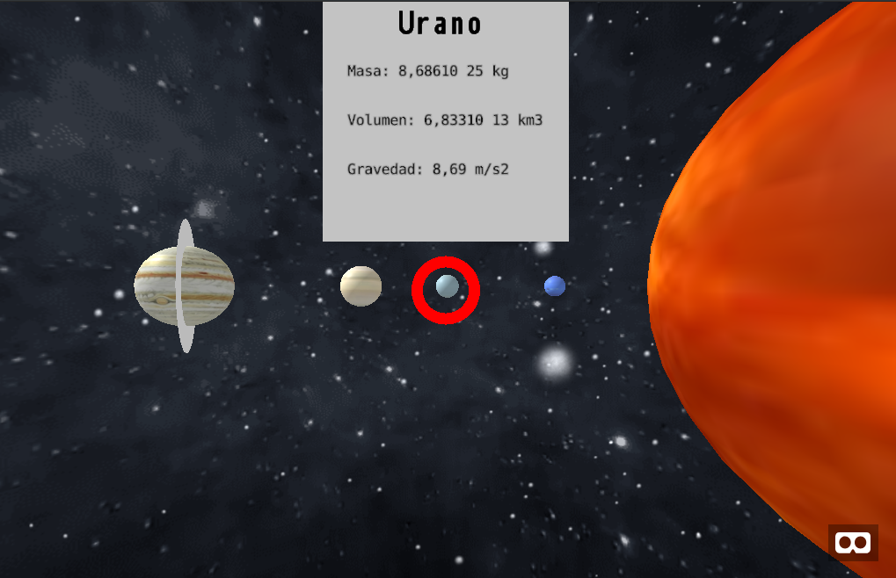
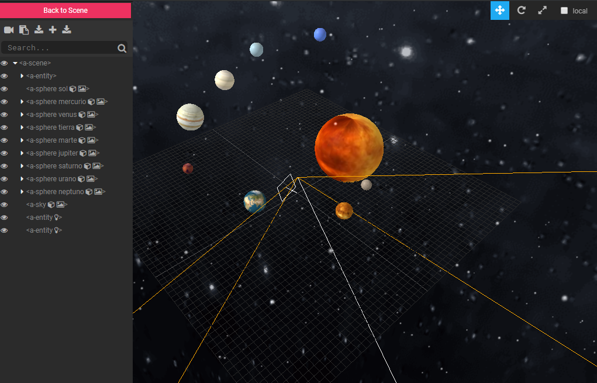

# SolarSystemVR
Solar system in virtual reality using the A-Frame web framework, simple interaction, by positioning on the planets we can see information about it.

## Live demonstration
Visit:
- https://javierblancoch.github.io/SolarSystemVR/

## Credits
This project would not be possible without:
- https://github.com/aframevr/aframe
- https://github.com/IdeaSpaceVR/aframe-particle-system-component
- https://www.solarsystemscope.com/textures/
